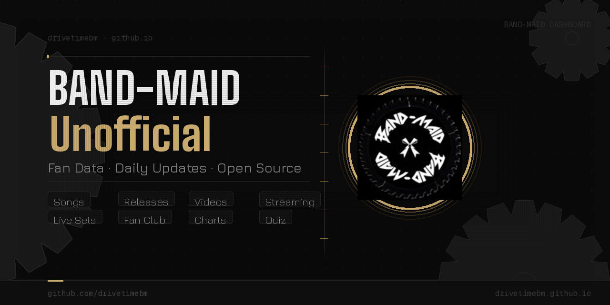

# BAND-MAID Unofficial

A comprehensive fan web app for BAND-MAID data — songs, releases, events, streaming, and much more. Built on publicly hosted JSON files that update daily. No accounts, no ads, no login required.

👉 **[BAND-MAID Unofficial app](https://drivetimebm.github.io/BAND-MAID_unofficial/)**
---

## Views

| Icon | View | Description |
|------|------|-------------|
| 🗓️ | **Calendar** | Upcoming BAND-MAID happenings. Updated as needed. |
| 📝 | **Songs** | All BAND-MAID songs with member quotes where available. Spotify stream counts updated weekly. |
| 💿 | **Releases** | Information on every BAND-MAID release. |
| ▶️ | **Videos** | All BAND-MAID YouTube content with view counts. Updated daily. |
| 🟢 | **Spotify** | All songs on Spotify sorted by stream count. Updated daily, each song refreshed weekly. |
| 🎶 | **Streaming** | Links to BAND-MAID songs across streaming services with counts where available. |
| 🗺️ | **Okyuji** | Every BAND-MAID live set with links to the setlist.fm page. |
| 🎬 | **Prime** | All BAND-MAID Prime videos with links, grouped by type. |
| 🏮 | **Fan Club** | All OMEISYUSAMA-NO-KAI videos with links, grouped by type. |
| 🖼️ | **Gallery** | Links to all OMEISYUSAMA-NO-KAI special photo galleries. |
| 📸 | **Daily Photos** | Random photos posted by BAND-MAID, Akane, Kanami, Miku, MISA, and Saiki. Updated daily. |
| ⏳ | **Upcoming** | Countdown to the next two BAND-MAID events. YouTube videos within 24 hours of a million milestone are added automatically. Updated every 10 minutes. |
| 🎯 | **Next Million** | The next 4 YouTube videos projected to hit a million views based on yesterday's view rate. Updated daily. |
| 📍 | **Milestones** | Streaming platform and social media milestones. Updated daily. |
| 🎉 | **Anniversaries** | Anniversaries for song releases, birthdays, live debuts, okyuji, and YouTube videos. Updated daily. |
| 🎞️ | **GIFs** | 400+ BAND-MAID GIFs, optimized for size and load speed. |
| ❓ | **Quiz** | BAND-MAID trivia quiz. Updated daily. |
| 💵 | **Shop** | Products from BAND-MAID ONLINE SHOP, Amped Japan, Pony Canyon (US & Japan), and CDJapan. Updated weekly. |
| 🔟 | **Top 10** | The 10 best-performing YouTube videos from the previous day. Updated daily. |
| 👥 | **Followers** | Follower counts and links to official social media. Updated weekly. |
| 🎟️ | **Tickets** | BAND-MAID events via the Ticketmaster API with purchase links. Overseas shows only. Updated daily. |
| 📝 | **Reports** | Dozens of data reports looking at BAND-MAID stats in various ways. Updated daily. |
| 📹 | **Instagram** | Translated Instagram post archive from 2014-09-30 to 2025-09-11. |
| 🐦 | **Twitter** | Translated tweet archive from 2013-07-19 to 2025-09-10. |
| 📈 | **Charts** | Stream count graphs (YouTube from Feb. 2025, Spotify from July 2025) plus YouTube comment history since 2014. |
| 🔗 | **Links** | Curated links to BAND-MAID related things. |
| 🔢 | **Sorter** | Rank all BAND-MAID songs. Save progress anytime. Optionally submit results for fanbase-wide aggregation. |
| 📢 | **Feedback** | Anonymous feedback form for likes, dislikes, and ideas. |

---

## The Data

Everything in this app is powered by JSON files I create and maintain. They update automatically on a daily basis. **Anyone is free to use them.**

Each view in the app displays the direct URL to its data source. A sample of the key sources:

| Data | URL |
|------|-----|
| Songs | `https://drivetimebm.github.io/BAND-MAID_songs/songs.json` |
| Releases | `https://drivetimebm.github.io/BAND-MAID_gpt/releases/releases.json` |
| YouTube | `https://drivetimebm.github.io/BAND-MAID_gpt/youtube/youtube.json` |
| Spotify | `https://drivetimebm.github.io/BAND-MAID_gpt/songs/all_spotify.json` |
| Okyuji | `https://drivetimebm.github.io/BAND-MAID_gpt/okyuji/okyuji.json` |
| Calendar | `https://drivetimebm.github.io/BAND-MAID_gpt/calendar/calendar.json` |
| Milestones | `https://drivetimebm.github.io/BAND-MAID_gpt/misc/milestones.json` |
| Charts | `https://drivetimebm.github.io/BAND-MAID_gpt/misc/charts.json` |

All JSON data is also automatically imported into a public Google Sheet — copy or use it however you wish:

📊 **[BAND-MAID Data Google Sheet](https://docs.google.com/spreadsheets/d/1fUGjjPOjFFWoh8TbHOfgB4L6N0GmZIfo2JrPghNZsZU/edit?usp=sharing)**

---

## BAND-MAID Dashboard Discord

This app draws from the same data that powers the **BAND-MAID Dashboard** Discord server, which has even more extensive data and discussion. Open to everyone:

👉 **[discord.gg/tfpJ6xBWEN](https://discord.gg/tfpJ6xBWEN)**

---

## Tech

- Pure HTML / CSS / JavaScript — no frameworks, no build step
- Data served as static JSON from GitHub Pages
- Views are self-contained HTML files loaded in iframes
- App shell reads `views.json` to build navigation dynamically
- View layout and configuration generated by the included `bm-view-generator.html` tool

---

*Unofficial fan project. Not affiliated with BAND-MAID, MAIDIT, or Pony Canyon*
